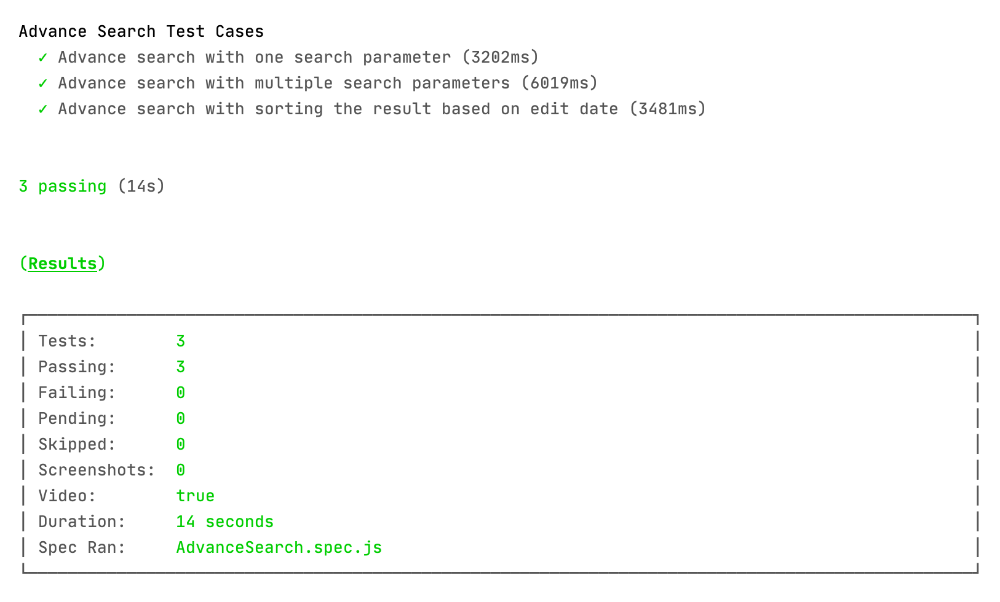

# Cypress Project SetUp: 


### Getting Started
The following instructions help you to set up a copy of the project and run it on your local machine for development and testing purposes.

### Prerequisites
* Code Editor (PhpStorm or your choice)
* Browsers (Chrome)
* NodeJS(https://nodejs.org/en/download/)
* Git (https://github.com/git-for-windows/git/releases/latest)
  
### Project SetUp
1. Open a new terminal (git bash) on code editor and move to your project directory ``` cd /your/project/path```
2. Run ```git clone https://github.com/Roopini-MN/OneFootballTask.git```
3. Run ```$ npm install``` command on your terminal`

### Running tests

Execution Command: ```npx cypress run --browser chrome --headed```

### Sample execution result


### Project Structure
Framework used: Page Object Model
##### fixtures folder
 Test data is present under fixture folder 
##### integration folder
Test cases are present under integration folder
##### support folder
* Inside support folder page classes and commands.js file is present
* Each page classes has respective page elements and methods
* Custom commands are written inside commands.js file
* Common methods are written inside Utils class

